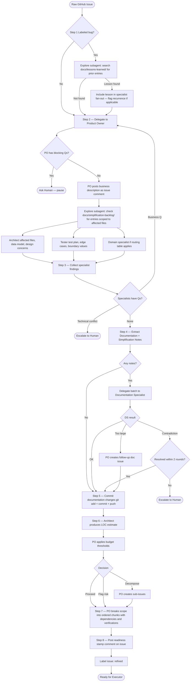
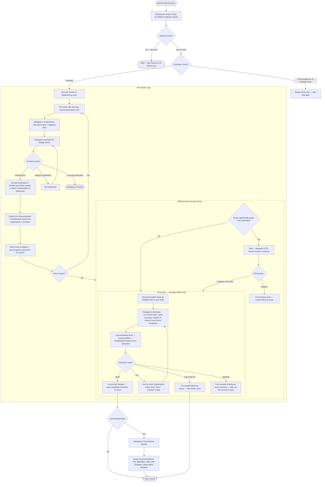
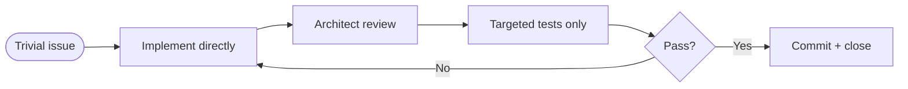
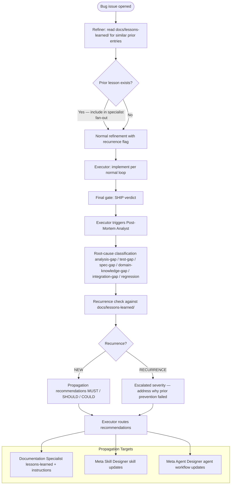
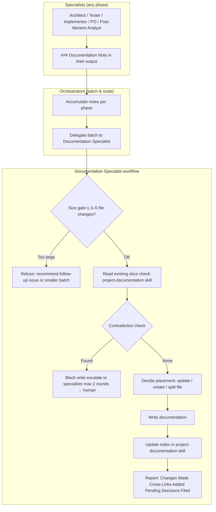
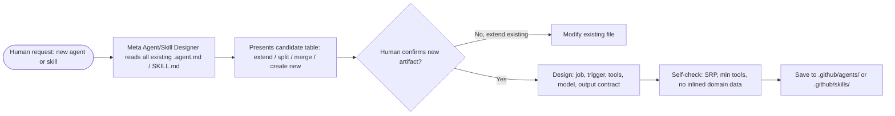

# Agent System – Roles and Workflows

This document describes every agent in the Happy Bank multi-agent system, their responsibilities, and the orchestration workflows that connect them. It is the authoritative reference for understanding how issues travel from raw request to shipped code.

---

## Agent Roster

| Agent | Model | Role |
|---|---|---|
| **Refiner** | Claude Sonnet 4.6 | Orchestrator — refines raw issues into implementation-ready specs |
| **Executor** | Claude Sonnet 4.6 | Orchestrator — drives implementation, review, and shipping |
| **Product Owner** | Claude Sonnet 4.6 | Business definition, acceptance criteria, chunk breakdown |
| **Architect** | Claude Opus 4.6 | Code quality, layer boundaries, SOLID/DRY/KISS, LOC estimates |
| **Implementor** | GPT-5.3-Codex | Writes production code and test code (TDD) |
| **Tester** | GPT-5.4 | Test plan design, coverage analysis, test specifications |
| **Reviewer** | GPT-5.4 | Final review gate — runs tests, inspects UI, verifies coverage, cross-chunk integration, and ship verdict |
| **Documentation Specialist** | Claude Sonnet 4.6 | Sole writer of all persistent documentation |
| **Post-Mortem Analyst** | Claude Opus 4.6 | Root-cause analysis after bug fixes ship |
| **Meta Agent Designer** | Claude Opus 4.6 | Designs and maintains `.agent.md` files |
| **Meta Skill Designer** | Claude Opus 4.6 | Designs and maintains `SKILL.md` files |

---

## Ownership Boundaries

- **Orchestrators** (Refiner, Executor) coordinate specialists; they never write code or docs themselves.
- **Implementor** is the only agent that writes or modifies source code.
- **Documentation Specialist** is the only agent that writes or modifies files in `docs/` or `.github/instructions/`.
- **Meta agents** operate at the system level: they design the agents and skills that define the system.

---

## Refiner — Issue Refinement Workflow

The Refiner takes a raw GitHub issue and produces a fully specified, implementation-ready task definition.

### Refiner Iteration Limits

| Loop | Max rounds | On cap hit |
|---|---|---|
| PO ↔ specialist clarification | 2 | Escalate to human |
| Full specialist re-analysis | 1 | Post findings as-is, flag uncertainties |
| PO decomposition attempts | 2 | Escalate to human if chunks still too large |

---

## Executor — Implementation Workflow

The Executor drives implementation from a refined issue to shipped, committed code. It loops per chunk, then applies a final holistic gate.

### Executor Iteration Limits

| Loop | Max rounds | On cap hit |
|---|---|---|
| Implementor ↔ architect per chunk | 2 | Escalate to human with both positions |
| Final gate fix cycle | 1 | Ship with known issues as FOLLOW-UP, or escalate |
| Total chunks per execution | 5 | Remaining work becomes follow-up issue |

### Executor Trivial Mode

For single-file changes with no business logic (typo, config, simple bug). Final gate is skipped.

---

## Bug Fix — Full Flow with Post-Mortem

When an issue is labeled `bug`, both the Refiner and the Executor add extra steps.

---

## Documentation Flow

Documentation is a first-class citizen — it flows through every phase.

---

## Meta System — Agent and Skill Lifecycle

---

## Routing by Change Area

Orchestrators use this table to select specialists for each task.

| Change area | Required specialists | Optional |
|---|---|---|
| New API endpoint | Architect, Tester | Product Owner (if AC unclear) |
| Business logic (services) | Architect, Tester | Product Owner |
| Data model change | Architect, Tester | Product Owner |
| Validation rules | Architect, Tester | — |
| Database migration | Architect | Tester |
| Documentation only | Documentation Specialist | — |
| CI/CD pipeline | Architect | Tester |
| Frontend (`resources/web/`) | Architect | Tester |
| Bug fix | Architect, Tester | Post-Mortem Analyst (after fix ships), Documentation Specialist (lessons learned) |

---

## Definition of Done

A task is complete only when **all** of these hold:

1. **Code implemented** — conventions and architecture rules followed.
2. **Tests passing** — full suite passes; new/changed logic has adequate test coverage.
3. **Documentation propagated** — findings included as `### Documentation Note` in agent output; Documentation Specialist applied changes.
4. **Changes committed** — all modified files committed with a descriptive English message referencing the issue number (e.g., `fix: brief description (#12)`).
5. **Issue closed** — GitHub issue closed with a summary comment.

> Changes **must be committed before** the issue is closed. Never close an issue with uncommitted work.
